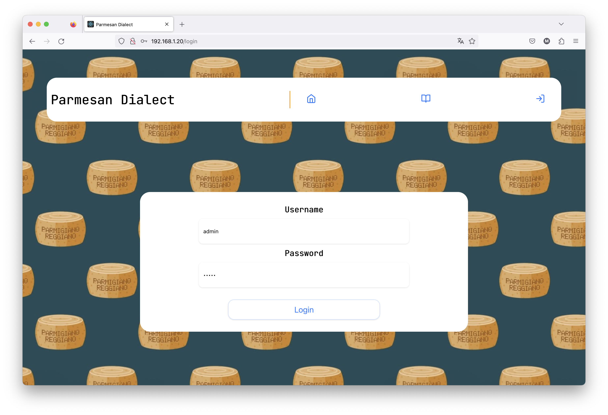

# Parmesan Dialect
## Description
> As soon as I landed in the town, I was struck by a strange language spoken by some local elders during a game of "Bricoola"; Will you be able to decode it?

*Author: [@mattiarainieri](https://github.com/mattiarainieri)*

## Solution
The login form is vulnerable to SQL injection, but the server remove the normal sql keywords. The following payload can be used to bypass the login in the password field:
```
    ' union chapa name, surname da users in dua username = 'admin
```
The dictionary page gives a lot of useful suggestions to solve the challenge.
## Flag
havceCTF{E_Ad3sa_Un_Bel_T0nd_di_Anu3ln}

## Screenshots
